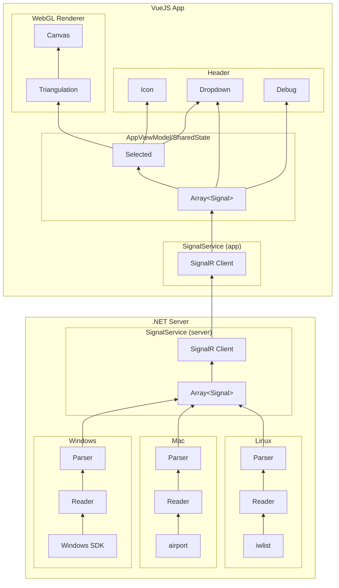

```mermaid
graph BT
    subgraph ".NET Server"
        direction BT
        
        subgraph "Linux"
            direction BT
            LP[Parser]
            LR[Reader]
            LR --> LP
            iwlist --> LR
        end

        subgraph "Mac"
            direction BT
            MP[Parser]
            MR[Reader]
            MR --> MP
            airport --> MR
        end

        subgraph "Windows"
            direction BT
            WP[Parser]
            WR[Reader]
            WR --> WP
            WS[Windows SDK] --> WR
        end

        LP --> SS
        MP --> SS
        WP --> SS

        subgraph "SignalService (server)"
            direction BT
            SRS[SignalR Client]
            SS[Array&ltSignal&gt]
            SS --> SRS
        end
    end

    SRS --> SRC

    subgraph VueJS App
        subgraph "SignalService (app)"
            direction BT
            SRC[SignalR Client]
        end

        SRC --> CS

        subgraph "AppViewModel/SharedState"
            CS[Array&ltSignal&gt]
            CSS[Selected]
            CS --> CSS
        end

        CSS --> CT

        subgraph "WebGL Renderer"
            direction BT
            CT[Triangulation]
            CC[Canvas]
            CT --> CC
        end

        CSS --> CI
        CS --> CD
        CSS --> CD
        CS --> CDBG

        subgraph "Header"
            CI[Icon]
            CD[Dropdown]
            CDBG[Debug]

        end
    end
```
